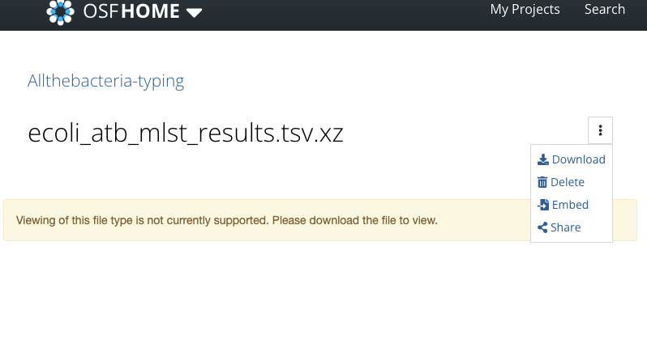

# *Escherichia coli* Typing

This directory contains analyses and results for *Escherichia coli* typing as part of the [AllTheBacteria](https://allthebacteria.readthedocs.io/en/latest/) project.

**Definition:**
> *Escherichia coli* is defined here as all [sylph](https://github.com/bluenote-1577/sylph)-identified *E. coli* genomes from the AllTheBacteria dataset.

**Note:**
- The [sylph](https://github.com/bluenote-1577/sylph) tool considers *Shigella* species as *E. coli*, so these genomes are included.
- There may be conflicting species designations between sylph and other tools. This means:
  - Some true *E. coli* genomes may be missing.
  - Some non-*E. coli* genomes may be included.

**How to download** 
There will be links to OSF that has the results. Open the OSF link from here, and then under the three dots right of the file name, there will be link to download the file under the drop-down. 



## Tools Used

- [mlst](https://github.com/tseemann/mlst) v2.23.0
  - [Achtman 7-gene MLST scheme](https://enterobase.warwick.ac.uk/) (schema downloaded from pubmlst on 2025-08-22)
  - Note: Anonymous access to pubmlst likely includes data up to 2024-12-31; this is the database version used here.
- [Ectyper](https://github.com/phac-nml/ecoli_serotyping) v2.0.0

The full list of software and dependencies is available in [pixi_env.txt](pixi_env.txt).

## MLST Typing

Genomes were typed using [multi-locus sequence typing (MLST)](https://github.com/tseemann/mlst) with the Achtman scheme.

MLST was installed using `pixi`. I used the instructions on the `mlst` github to [update the database](https://github.com/tseemann/mlst?tab=readme-ov-file#updating-the-database). 

MLST was run on our HPC cluster, and jobs and results were handled by my dodgy python script. For completness, this is included here under [dodgy_scripts/mlst.py](dodgy_scripts/mlst.py). This script is not intended for public consumption. 

**Results:**

| File/Resource                                                                | Description                                                                  |
|------------------------------------------------------------------------------|------------------------------------------------------------------------------|
| [Manifest (tab-delimited)](https://osf.io/vrwcd)                             | Status (PASS, FAIL, NOT DONE) for each genome; manifest of included genomes. |
| [Raw MLST results table](https://osf.io/ypzbq)                               | Unmodified results table output from MLST software.                          |
| [MLST results for *E. coli* (tab-delimited)](https://osf.io/69yde)           | Final processed MLST results for *E. coli*.                                  |

I have opted to alter the raw results from the MLST software. The specific loci and number of loci for different schemes varies, and to keep the results table consisent, I have opted to keep the allele numbers as comma-seperated values in one column called "Alleles". 

Hence, the results file will look like this: 

```
Sample	Scheme	ST	Alleles
SAMN18191398	ecoli_achtman_4	-	adk(6),fumC(4),gyrB(3,54),icd(1279?),mdh(11),purA(8),recA(6)
SAMEA9477427	ecoli_achtman_4	-	adk(20),fumC(762),gyrB(41),icd(43),mdh(5),purA(1157?),recA(2)
SAMN17165499	ecoli_achtman_4	-	adk(10),fumC(11),gyrB(4),icd(~8),mdh(8),purA(8),recA(2)
SAMD00107106	ecoli_achtman_4	10	adk(10),fumC(11),gyrB(4),icd(8),mdh(8),purA(8),recA(2)
SAMD00107093	ecoli_achtman_4	10	adk(10),fumC(11),gyrB(4),icd(8),mdh(8),purA(8),recA(2)
....
```


## ECTYPER

Genomes were typed using [ECTyper](https://github.com/phac-nml/ecoli_serotyping).

ECTyper was installed using `pixi`. 

ECTyper was run with `--verify --pathotype` flags:

* ``--verify`` will verify species (i.e. if sample is E.coli) and run QC module providing information on the reliability and suitability of the serotyping and pathotyping results as a function of predicted species.	 
* ``--pathotype`` will perform DEC pathotype and Shiga toxin subtyping prediction on a sample.

As such, ECTyper results will include serotype, pathotype, and species classification. For more information about ECTyper [please see the paper](https://www.microbiologyresearch.org/content/journal/mgen/10.1099/mgen.0.000728).

ECTyper was run on our HPC cluster, and jobs and results were handled by my dodgy python script. For completness, this is included here under [dodgy_scripts/ectyper.py](dodgy_scripts/ectyper.py). This script is not intended for public consumption. 

**Results:**

| File/Resource                                                                | Description                                                                  |
|------------------------------------------------------------------------------|------------------------------------------------------------------------------|
| [Manifest (tab-delimited)](https://osf.io/un6ts)                             | Status (PASS, FAIL, NOT DONE) for each genome; manifest of included genomes. |
| [Raw ECTYPER results table](https://osf.io/pbd8x)                            | Unmodified, merged results table output from ECTYPER software.               |
| [BLAST ECTYPER results table](https://osf.io/x6jva)                          | Unmodified, merged BLAST hits table output from ECTYPER software.            |
| [ECTYPER results for *E. coli* (tab-delimited)](https://osf.io/tx5m6)        | Final processed ECTYPER results                                              |


## Contact

For questions regarding *E. coli* typing, please contact [Nabil-Fareed Alikhan](mailto:nabil@happykhan.com).
